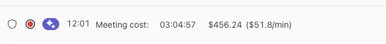
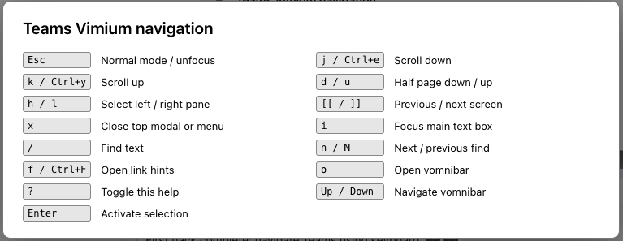
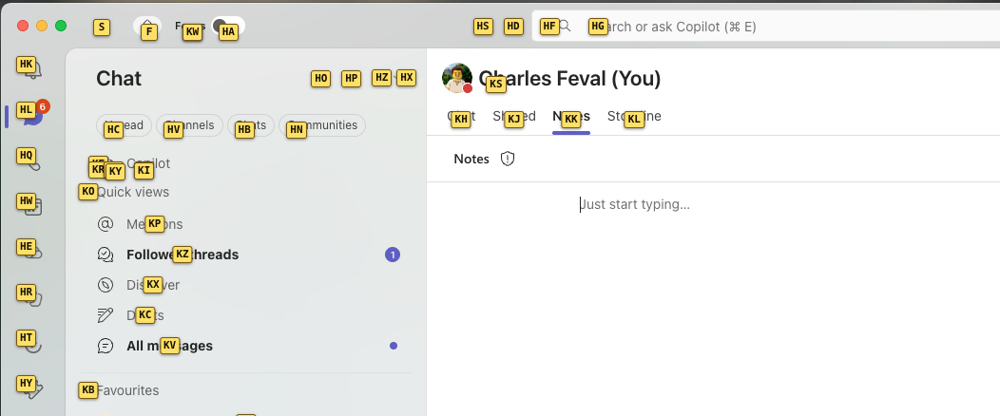
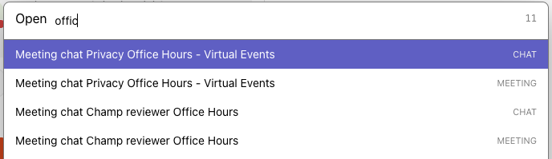
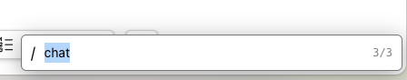
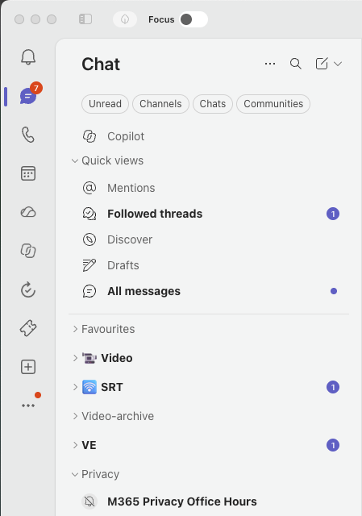
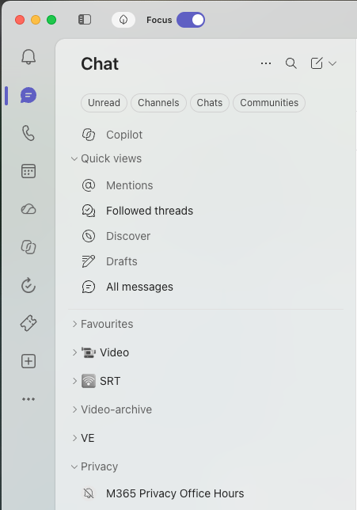

# Teams user scripts

This repository is a catalogue and distribution source for UserScripts that
work in the Microsoft Teams web app. The root [`index.json`](./index.json)
lists each available script, its description, and its download path.

To load these scripts in the Teams desktop client, install
[Teamsmonkey](https://github.com/cfe84/teamsmonkey). Teamsmonkey loads scripts
from `~/.config/teamsmonkey/scripts` on macOS and Linux, and from the
equivalent per-user AppData directory on Windows. Set
`TEAMSMONKEY_SCRIPT_PATH` to use another directory.

The catalogue can be added directly to Teamsmonkey with this repository URL:

<https://github.com/cfe84/teams-user-scripts>

Individual scripts are also available as raw files, for example:

<https://github.com/cfe84/teams-user-scripts/raw/refs/heads/main/userscripts/teams-vimium.user.js>

## Available scripts

### Meeting meter

Tracks participant time and estimated meeting cost during meetings

Time is calculated in real-time, based on how many participants are in the meeting at any moment. The meter shows the accumulated meeting cost and the current cost per minute based on the participants currently in the meeting.

When you join later, the meter simply assumes that everyone in the meeting has been there for the full length of the meeting. After that, it tracks attendance second by second to calculate.

### Vimium

**Teams Vimium navigation**: Vimium-style scrolling, pane selection, find, hints, and navigation for Teams, inspired by the [vimium browser extension](https://vimium.github.io/)

Vimium works by using modes. There are two modes: 

- `normal`, in which you navigate using you keyboard
- `insert`, in which you can type normally

Vimium automatically switches to insert when you enter or click a text box, or press the `i` key. It goes back to normal when you press `esc`, or leave a text box.

The `?` key displays a help menu with available keys.

**Hints** are prehaps the most useful navigation feature of vimium. When you press the `f` key, hints are displayed on all clickable elements of the UI. Then type any hint to automatically click on it.

**Omnibar** is another very powerfull navigation tool. Press the `o` key, and a text box opens. Type the name of any chat, meeting, or menu to navigate to it.

The `h` and `l` keys are used to navigate horizontally between columns (conversation, chat list, and meetings in the meeting view). The `j` and `k` keys are used to navigate vertically, scroll up and down in conversation and chat list, move one meeting up/down in meetings. `u` and `d` go half a page up/down.

The `/` allows to search, then click anything on the page. Press enter then `n` to navigate between matches, then `enter` to click the right one, or `esc` to leave search mode.

## Focus mode

Have you ever watched a meeting recording in Teams, a notification pops up and you automatically click on it: you lose the recording and need to get back to hit, and scroll to search where you left it? Similar experiences with Word and PPT documents? This extension is here to help.

**Teams Focus mode**: Reduces visual emphasis for unread messages and notifications, to avoid capturing your focus while you read a document, watch a recording.

It adds a toggle at the top of the screen to switch focus-mode on.

With focus mode, notifications go away, no more formatting, even colours fade away, to let you focus while you do what you have to do:

